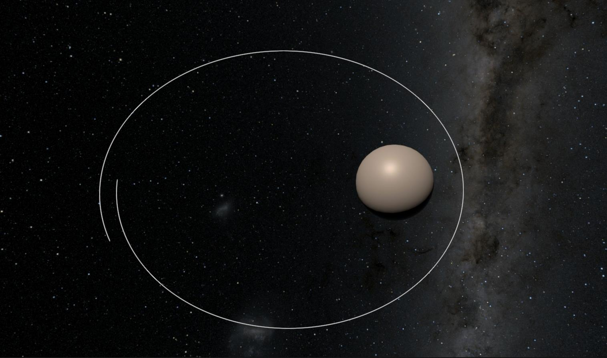
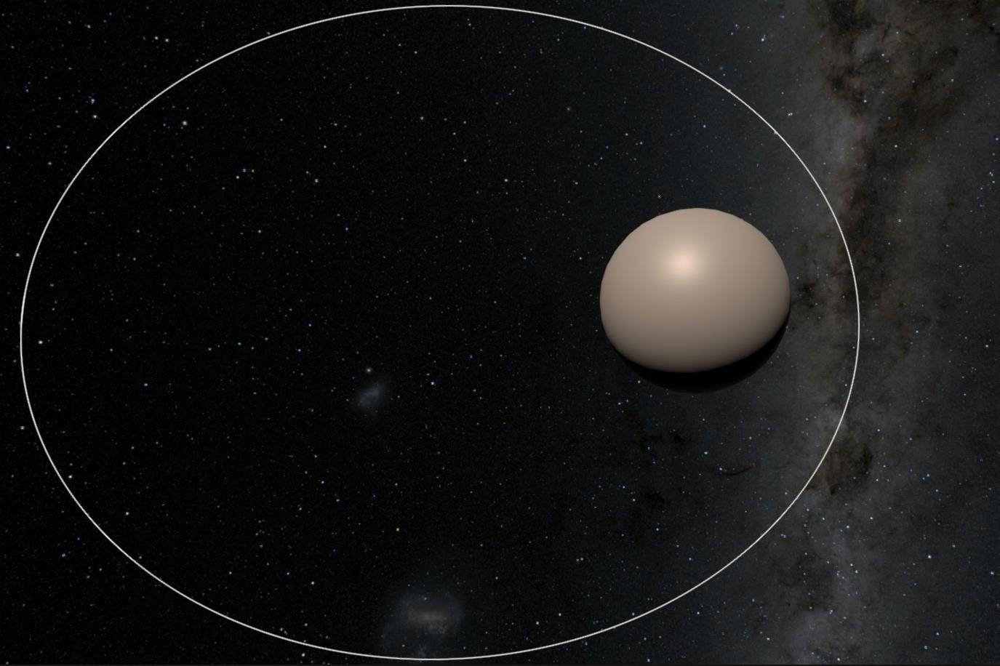

---

In Ephemeris we start out with the acceleration acting on a body (calclulated from the nearby gravity sources) and need to calculate the velocity and then the position. This process is called **Integration**.

There are many choices of integration system, with many tradeoffs.

## Equations Of Motion

This section is a very brief refresher on the equations of motion and some of the notation used.

 - `a` = acceleration
 - `v` = velocity
 - `x` = position
 - `t` = time
 - `dv` = change in velocity
 - `dx` = change in position
 - `dt` = change in time

Acceleration is a measure of how much the velocity changed ($$dv$$) over some amount of time ($$dt$$):

$$a = dv / dt$$

Velocity is a measure of how much position changed ($$dx$$) over some amount of time ($$dt$$):

$$v=dx/dt$$

## The Simplest Integrator

An [Euler](https://en.wikipedia.org/wiki/Euler_method) integrator is the most basic integrator that there is. If you know acceleration then you can simply work out position by multiplying out `dt` and adding together the results:

$$a=Acceleration(x)\\\
x_1=x_0+v*dt\\\
v_1 = v_0 + a * dt$$

Or in code:

```python
time = 0
delta_time = 0.1

position = 0
velocity = 0

while (True):
  acc = acceleration(position) # Calculate acceleration somehow

  position += velocity * delta_time
  velocity += acc * delta_time
  time += delta_time
  print(position)
```

The problem with this method is that it assumes nothing changes over the timestamp. Acceleration is a _constant_ change in velocity but in this system acceleration is only applied at the start of the timestep, so the velocity is wrong for most of the time.

We can calculate the position of an object under constant acceleration **exactly** using the [equations of motion](https://en.wikipedia.org/wiki/Equations_of_motion):

$$s=ut+0.5at^2$$

So let's compare just about bad this is. Assuming initial velocity (`u`) is `10`, acceleration (`a`) is 1 and timestep (`dt`) is 1:

| Time | Euler | Exact |
|------|-------|-------|
| 1 | 10 | 10.5 |
| 2 | 21 | 22.0 |
| 3 | 33 | 34.5 |
| 4 | 46 | 48.0 |
| 5 | 60 | 62.5 |

As you can see Euler is falling behind the correct answer, because the velocity is too low over the entire timestep. A smaller timestep would reduce this error, but it would never eliminate it. This is because the Euler integrator is not _energy preserving_ (aka symplectic).

Here is what these errors looks like when simulating an orbit:



As you can see after just one orbit it has completely diverged.

For most games this isn't an issue because the physics timestep is sufficiently small (e.g. Unity fixed `timestep = 1/50`) and the accuracy demands are very low. In some situations (e.g. cloth simulation) the instability can become a problem and more specialised integrators are used (e.g. [Verlet](https://en.wikipedia.org/wiki/Verlet_integration)).

However this is not the case in Ephemeris. The requirements for the integrator are very high:
 - Energy should be preserved (so orbits do not fall apart).
 - Timestep: should be as large as possible so that orbits can be simulated days or weeks in advance.
 - Accuracy: should be high so orbits are correct to the real world.

## Leapfrog
[Leapfrog integration](https://en.wikipedia.org/wiki/Leapfrog_integration) updates positions and velocities at interleaved timesteps. The simplest leapfrog integrator is the [Semi-Implicit Euler Method](https://en.wikipedia.org/wiki/Semi-implicit_Euler_method):

$$a=Acceleration(x)\\\
v_1=v_0+a*dt\\\
x_1=x_0+v*dt$$

This looks a lot like the Euler integrator. In fact all that has changed is the velocity is calculated first! This is now a second order integrator, which is an improvement over Euler. [These lecture notes](https://young.physics.ucsc.edu/115/leapfrog.pdf) dive into the topic in more detail.

:::tip

If you're looking for an easy to implement integrator to use for an orbital game, use this!

:::

This is a huge improvement:



There are other leapfrog methods which improve other characteristics, for example the `4th order Yoshida integrator` allows larger timesteps at the cost of three evaluations of the `Acceleration(x)` function.

However, all leapfrog integrators share a fatal flaw - they require a fixed timestep. Because the updates are interleaving half steps changing the timestep is very difficult. Ephemeris would have to pick one single timestep that is suitable for all cases, either compromising accuracy or speed.

## Hermite
Hermite integrators are frequently used for astrophysical simulations. They can be very high-order which allows them to use large timesteps. The timestep can be adaptive, automatically calculating the next timestep based on an approximation of the error in this step.

The adaptive timestep of a Hermite integrator is designed to reduce the timestep of the whole simulation, based on the worst error for any particle. For a full n-body simulation (where every particle pulls on every other particle) this is necessary - you must update every particle together to be able to calculate the gravity for any particle. However this is not necessary for Ephemeris and in fact is a significant optimisation - we can assume that planets pull on spacecraft (including missiles, satellites, drones etc) but ships _do not_ pull on other ships. This means that every ship can be updated in parallel with the best timestep for itself.

Because of this I didn't get much further into researching Hermite integrators. Here are some assorted notes:
 - Adaptive timestep
 - Existing implementations
	 - `GravityEngine` (Asset store)
	 - https://github.com/jagoosw/Gravitational-N-Body-Simulation
 - https://courses.physics.ucsd.edu/2006/Winter/physics141/
	 - https://courses.physics.ucsd.edu/2006/Winter/physics141/labnote5/nbody_sh1.pdf
	 - https://courses.physics.ucsd.edu/2006/Winter/physics141/labnote4/nbody0-lab.c
 - https://gravidy.xyz/include/integrator.html
 - https://elib.dlr.de/118831/2/2017-07-26_KePASSA2017_Hermite_integration_JR.pdf (final slide)
 - https://conference.sdo.esoc.esa.int/proceedings/sdc7/paper/14/SDC7-paper14.pdf

## Runge-Kutta
Runge-Kutta methods are a family of integrators. RK4 (Runge-Kutta 4th Order) is frequently used in games which need something a little better than implicit Euler can offer. See [this classic tutorial](https://gafferongames.com/post/integration_basics/) on game integration, or [this one](https://prappleizer.github.io/Tutorials/RK4/RK4_Tutorial.html) on RK4 for orbital simulation for more information.

RK4 is not energy preserving, which would normally eliminate it from consideration for orbital simulation. However it is _pretty good_ at conserving energy and reducing the timestep helps it conserve energy. Since the timestep can be adaptive you can constantly adjust to the best tradeoff of speed/accuracy.

The [Runge-Kutta-Fehlberg method](https://en.wikipedia.org/wiki/Runge%E2%80%93Kutta%E2%80%93Fehlberg_method) (aka RKF-45) is a 4th order integrator with a 5th order error estimator, step size is automatically determined based on the estimated error. This means that the integator can take very large steps (e.g. several **minutes**) in open space and slows down to preserve accuracy in more complex environments (e.g. close approach to a planet).

Some references on adaptive timesteps for RK methods:
 - https://stackoverflow.com/questions/67043427/how-to-perform-adaptive-step-size-using-runge-kutta-fourth-order-matlab
 - https://people.computing.clemson.edu/~dhouse/courses/817/papers/adaptive-h-c16-2.pdf
 - https://fncbook.github.io/fnc/ivp/adaptive.html#equation-adaptrkglobal
 - https://math.stackexchange.com/questions/234263/procedure-for-adaptive-step-size-for-runge-kutta-4