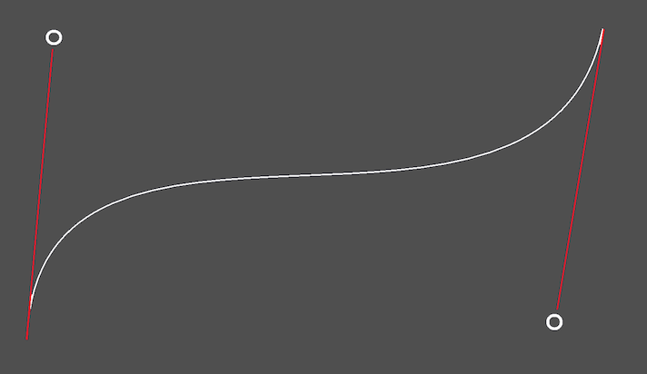
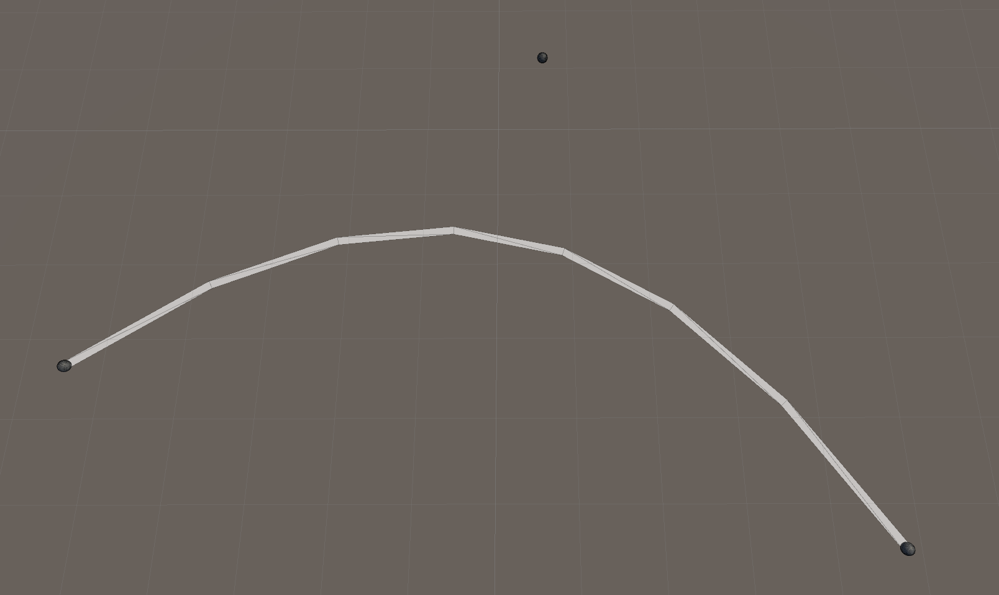
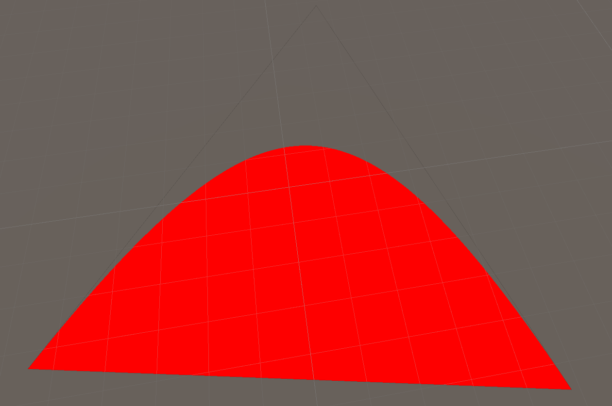
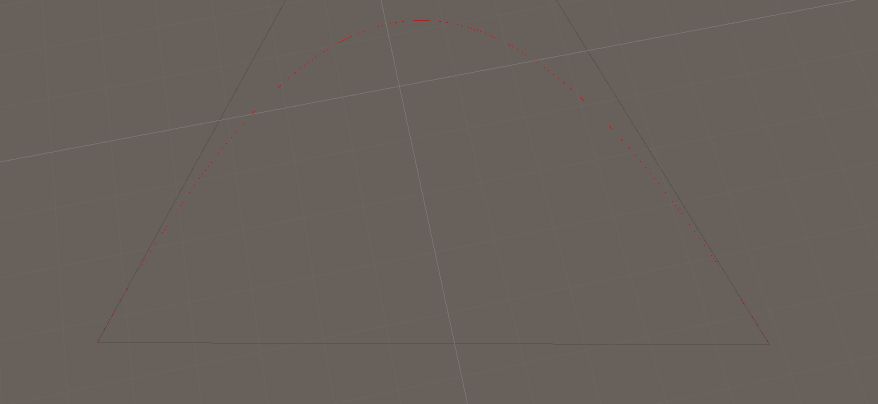
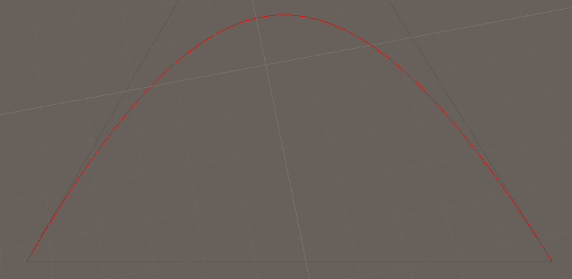
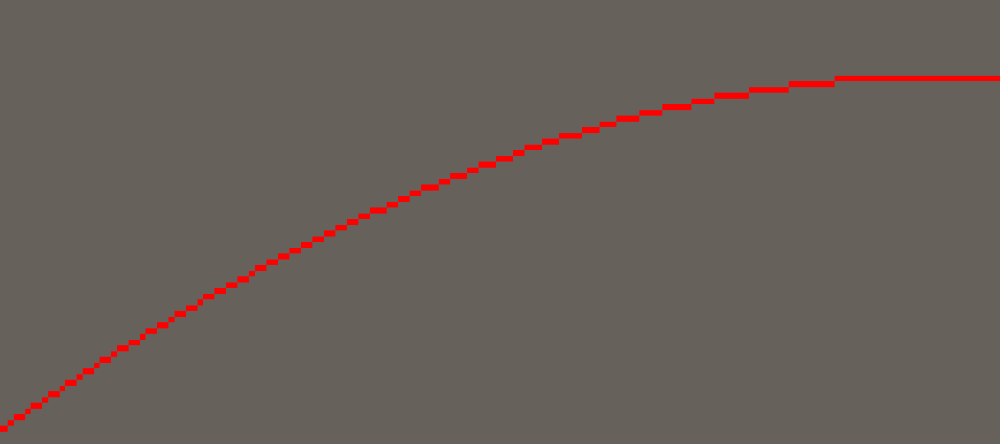
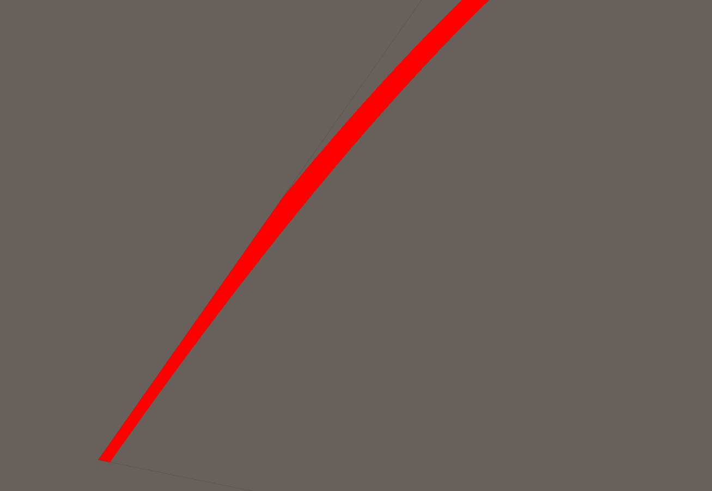
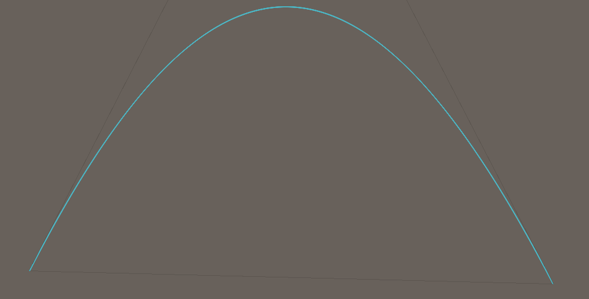
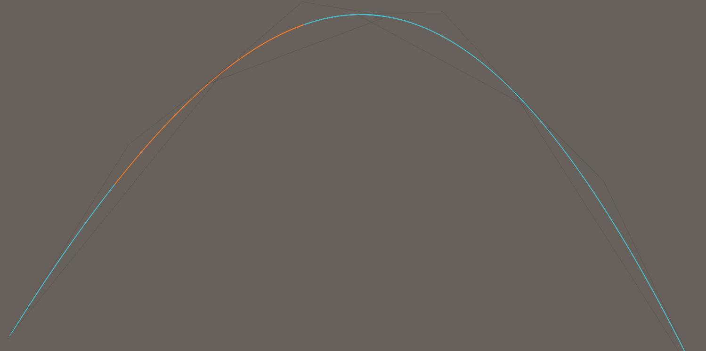

Ephemeris needs to draw a lot of lines to show orbital paths. In fact most of the important information in the game is communicated entirely with lines and UI elements!

Some other articles have discussed rendering lines:
 - [[GPULines]]
 - [[CPULines]]
 - [[LineGridRendering]]

This article does not discuss the details of converting an orbital path into the data necessary to render the entire line. Instead we will focus on one specific detail: rendering a quadratic bezier curve entirely on the GPU, using just one triangle!

### Bezier Curves 101
First of all; what is a quadratic bezier curve?



A bezier curve is a smooth curve, created by interpolating between various control points. The line starts and ends at the first and last control points, but does not pass through the intermediate control points. They are very widely used in games, [here's a tutorial that goes into much more depth](https://catlikecoding.com/unity/tutorials/curves-and-splines/).

A Quadratic bezier curve is the simplest kind of bezier curve with just three control points; start, control point, end.

:::info

Ok technically a straight line is the simplest kind of bezier with just two control points. But that doesn't really count!

:::

### Bezier Curve Rendering
A bezier curve can be approximated by a series of straight lines. This example is rendered using the Unity `LineRenderer` component and a very simple script that evaluates the bezier curve at 8 points.



Of course this could be made to use a more reasonable number of points, but that will always be an approximation made out of straight lines. We can do better!

#### Enter Nvidia
[This article](https://developer.nvidia.com/gpugems/gpugems3/part-iv-image-effects/chapter-25-rendering-vector-art-gpu) from **GPU gems 3** details an approach to rendering bezier curves using just one triangle!


The article explain in detail how it works, so I'll only cover the basics here. It is based on texture interpolation. The uv coordinates are setup as:
 - Start: `[0, 0]`
 - Middle: `[0.5, 0]`
 - End: `[1, 1]`

The exact edge of the bezier curve is then the position where:

$$u^2 - v = 0$$

All positive values are "above" the curve (shown in white) and all negative values are "below" the curve (shown in orange). So a simple shader that looks like this:

```hlsl
float x = i.uv.x * i.uv.x - i.uv.y;
clip(-x); // Remove all pixels where `-x` is negative
return float4(1, 0, 0, 1);
```

Produces this result:



Halfway there, but now we need to render a _line_ instead of a region. This could be done by checking if `x` is _nearly_ zero.

```hlsl
float x = i.uv.x * i.uv.x - i.uv.y;
clip(x > -Thickness && x < Thickness ? 1 : -1);
return float4(1, 0, 0, 1);
```

With a constant `Thickness` value the line is too fat when close, but becomes thinner than one pixel when far away:



The absolute minimum thickness can be determined with the change in `x` across a single pixel:

```hlsl
float dx = abs(ddx(x));
float dy = abs(ddy(x));
float min_width = 0.5 * max(dx, dy);

clip(x > -min_width && x < min_width ? 1 : -1);
return float4(1, 0, 0, 1);
```

Which achieves a line that's exactly 1 pixel wide, no matter how far from the camera:



There's still a small improvement that can be made to this though. The line is now exactly 1 pixel wide, which means it has jagged edges. In fact even if the line was wider it would still have very hard edges. let's zoom way in to see it better:



Instead of clipping when `x > min_width` let's add one extra row of pixels. Those pixels can have their alpha set between 0 and 1, based on the value of `x` (closer to zero means closer to 1 alpha).

```hlsl
// Remove all pixels "above" the curve except for a single row
clip(-x + min_width);

// Alpha blend that one row of pixels above
if (x > 0) {
    return float4(1, 0, 0, saturate(1 - x / min_width));
}
```


As you can see the top is much smoother.

The same effect can be applied to the bottom, but before we do that there's final thing to add: line thickness. At the moment the line is _always_ 1 pixel wide. Thickness would be easy to add by multiplying with `min_width` but that would look bad:



As you can see the line is pressed up against the edge of the geometry and is cut off, leading to inconsistent width towards the end. This is because the line has been expanded outwards in both directions. To avoid this the line should be expanded inwards only.

Once this is all put together:



### Perfection?
So is this the perfect way to render a bezier curve? no.

There is one very big problem with the approach so far: look at just how large the triangle is compared to the number of pixels that are shaded - that's a huge amount of wasted overdraw!

Fortunately there's a solution to this too. A single quadratic bezier with points `a, b, c` can be split at point `z` into two bezier curves:

```csharp
private static (BezierCurve, BezierCurve) Split(float3 a, float3 b, float3 c, float z)
{
    var P10 = a;
    var P11 = (1 - z) * a + z * b;
    var P12 = math.pow(1 - z, 2) * a + 2 * (1 - z) * z * b + math.pow(z, 2) * c;

    var P20 = P12;
    var P21 = (1 - z) * b + z * c;
    var P22 = c;

    return (
	    new BezierCurve(P10, P11, P12),
	    new BezierCurve(P20, P21, P22)
	);
}
```

This can be used to split the triangles into smaller triangles, reducing the overdraw. In this exampe the two triangles are adjusted so that they overlap, which hides artefacts around the join:

