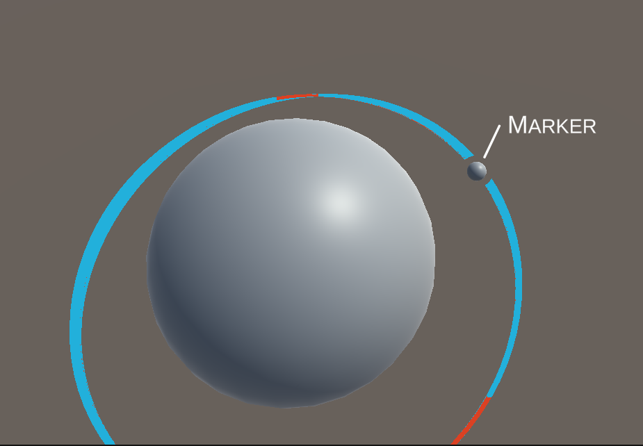
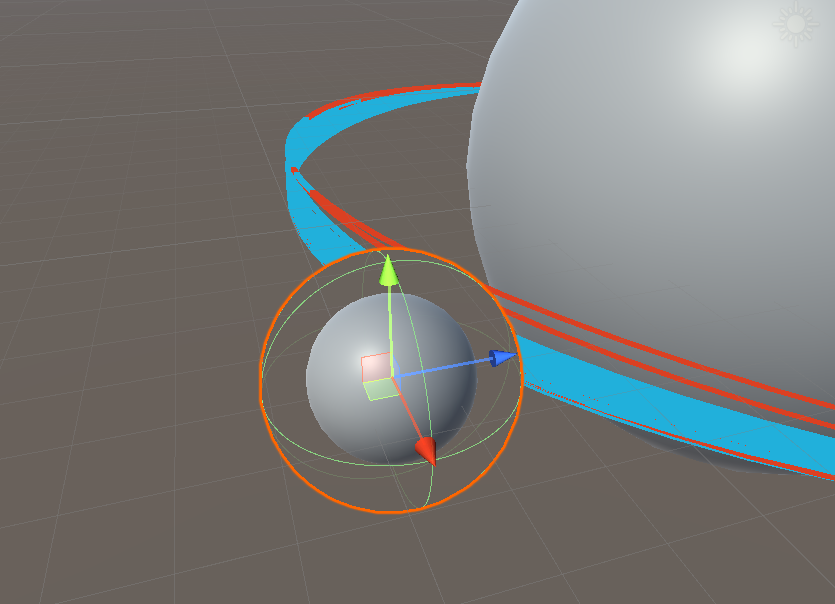

Ephemeris needs to draw a lot of lines to show orbital paths. In fact most of the important information in the game is communicated entirely with lines and UI elements!

Orbital paths have several requirements:
- They have a **lot** of points (e.g. 2+ weeks of orbital movement)
- Position data between points should be interpolated non-linearly (specially when zooming in)
- Scale of positions is literally astronomical (double precision may be required).
	- The line may even go beyond the camera far plane and should still be visible!
- Extra information should be able to be shown (e.g. engine burn start/end times).
- UI elements (e.g. markers of special events) should be able to "interact" visually with lines.
- Line should be constant screen size so that it is visible at vast distances.

## The Goal

Here is an example image, showing everything required.
 - Note the border around the marker sphere where the line disappears.
 - Red sections indicate engine burns, these should be pixel perfect.
 - Everything in this image could be beyond the camera far plane!



## Research
While working on line rendering I came across several other approaches for rendering lines. Here's an unordered list:
 - [Unity LineRenderer](https://docs.unity3d.com/Manual/class-LineRenderer.html)
	 - Does not handle huge scale
	 - Cannot render with constant screen width
 - [Volumetric Lines - Unity Asset](https://github.com/johannesugb/VolumetricLinesUnity)
	 - Make sure to use the `universal_render_pipeline` branch!
	 - Uses shader tricks to render the line, maybe be useful down later with other line rendering techniques
		 -  https://web.archive.org/web/20150930205745/http://sebastien.hillaire.free.fr/index.php?option=com_content&view=article&id=54&Itemid=56
		 - https://web.archive.org/web/20111202022753/http://sebastien.hillaire.free.fr/index.php?option=com_content&view=article&id=57&Itemid=74
 - [Shapes Asset](https://assetstore.unity.com/packages/tools/particles-effects/shapes-173167)
	 - Great asset, highly recommended!
	 - Does not handle huge scale.
	 - Recomputing line mesh when position changes seems to be expensive (not jobified).
	 - `ShapesMeshGen.GenPolylineMesh` helper generates mesh, potentially this could be used directly to generate the mesh from inside a parallel `Task`.

## Approach 1: Pure GPU
My first approach to solving this problem was intended as a "pure GPU" solution:
1. Dump the orbital position data straight from the sim into a `ComputeBuffer`
2. Run a compute shader to create vertices along the line - adding extra vertices to interpolate the data.
3. Draw line-strip vertices
4. In geometry shader, emit new vertices to make the line wider (constant screen size).

This approach has a few problems. First of all, I'm not very familiar with compute shaders, and while I am learning more about using them for Ephemeris this would be tricky to implement (for me). Secondly, and maybe more importantly, geometry shaders are slow:
 - https://gamedev.stackexchange.com/questions/187584/has-the-geometry-shader-been-abandonded
 - http://www.joshbarczak.com/blog/?p=667

Maybe they're not slow enough to be a problem, but I don't want to put in all the effort to implement this approach only to discover it's not fast enough to actually use!

While researching this technique, I researched some geometry shader related things:
 - [Geometry shader grass](https://medium.com/chenjd-xyz/using-the-geometry-shader-in-unity-to-generate-countless-of-grass-on-gpu-4ca6d78b3de6)
 - [General geometry shader tutorial](https://gamedevbill.com/unity-vertex-shader-and-geometry-shader-tutorial/)
 - [LineStrip+GeometryShader](https://forum.unity.com/threads/geometry-shader-with-meshtopology-linestrip.684643/)

## Approach 2: No GPU Compute
The problems with the previous approach were compute shaders (i'm not very familiar with them) and geometry shaders (should be avoided because they're slow). My second approach tries to solve both of these problems.

#### Mesh Generation
The first step happens in the editor - procedurally generating lines with fixed numbers of vertices and storing these as assets. The lines are tubes, with 4 vertices around each point, this will be used later to give the line constant on screen size. My approach to procedurally generating the lines is to use a [`ScriptedImporter`](https://docs.unity3d.com/Manual/ScriptedImporters.html). Procedural generation parameters are stored in a file with a unique file extension (`.procline`) and then a scripted importer can pickup that file and run the generation in-editor. See more details [here](../ProceduralGeneration/EditorProceduralGeneration.md).

The second step is to copy the orbital data into a `ComputeBuffer`. The position data in the physics engine is in "world" space (1unit = 1m) relies on double precision to handle the vast distances involved. In Ephemeris this will be remapped into a smaller scale before rendering. Another `ComputeBuffer` is passed in with the start/end time of every engine burn (in order).

#### Data Preparation
A `ComputeBuffer` cannot be updated off the main thread, so a `Job` is used to prepare the data and the main thread copies it just before rendering:
```csharp
// Copy into buffers
burnDataBuffer?.Release();
burnDataBuffer = new ComputeBuffer(burns.Length, EngineBurnData.Size);
burnDataBuffer.SetData(burns);
positionDataBuffer?.Release();
positionDataBuffer = new ComputeBuffer(positions.Length, StructurePointData.Size);
positionDataBuffer.SetData(positions);

// Update material
Material.SetBuffer("_EngineBurns", burnDataBuffer);
Material.SetInt("_EngineBurnsCount", burns.Length);
Material.SetBuffer("_LinePositionData", positionDataBuffer);

// Free arrays
positions.Dispose();
burns.Dispose();
```

Before rendering an "arguments" buffer is needed to tell rendering what to do:
```csharp
argsBuffer?.Dispose();
argsBuffer = new ComputeBuffer(5, sizeof(uint), ComputeBufferType.IndirectArguments, ComputeBufferMode.SubUpdates);

var args = new NativeArray<uint>(5, Allocator.Temp);
args[0] = (uint)Math.Min(PointCount * 4, _renderMesh.vertexCount);
args[1] = 1;
args[2] = _renderMesh.GetIndexStart(0);
args[3] = _renderMesh.GetBaseVertex(0);

argsBuffer.SetData(args);
```

The args buffer values at each index ([docs](https://docs.unity3d.com/ScriptReference/Graphics.DrawMeshInstancedIndirect.html)) is:
 0. index count per instance
 1. instance count
 2. start index location
 3. base vertex location
 4. start instance location.

Finally in `Update` we can dispatch the rendering using [`DrawMeshInstancedIndirect`](https://docs.unity3d.com/ScriptReference/Graphics.DrawMeshInstancedIndirect.html):
```csharp
Graphics.DrawMeshInstancedIndirect(
	_mesh,
	submeshIndex: 0,
	Material,
	bounds,
	argsBuffer,
	layer: 0
);
```

### Vertex Shader
#### Positions
We're done with the CPU side of things, what does the GPU side look like? In the shader a compute buffer is declared with the same data layout as the CPU side:
```clike
struct LinePointProperties
{
	float timestamp;
	float3 position;
};
StructuredBuffer<LinePointProperties> _LinePositionData;
```

The vertex shader needs to do three main things:
 - Sample position data
 - Clamp to far-plane
 - Push vertices around to constant screen width

It also needs to prepare some data for the pixel shader:
 - timestamp (for pixel-perfect cutoff)
 - burn time (for pixel perfect burn info)

Let's break this down. First off sampling the data. Each vertex has an attribute which describes which data point it should sample. The XY position of the vertex is used as an offset from the data point:
```clike
// Sample data at index
LinePointProperties data = _LinePositionData[v.index];
float timestamp = data.timestamp;
float3 pivot = data.position;

// Read offset for this vertex from the mesh
float3 offset = float3(v.vertex.x, v.vertex.y, 0) * _ThicknessPx;
```

Now that we have the "world position" of the point (data.pivot), it's clamped to the farplane and transformed into clip space:
```clike
// Clamp to far plane
float3 pivotPos = clamp_farplane(pivot);

// Transform pivot into screenspace
float4 pivotScreen = UnityWorldToClipPos(pivotPos);
```

Now we want to apply the offset, correcting for screensize, to get a constant on-screen width. This is derived from [this blog post](https://mattdesl.svbtle.com/drawing-lines-is-hard) about line drawing.
```clike
// Write out result
v2f o;
o.vertex = pivotScreen + float4(offset / _ScreenParams.y * pivotScreen.w, 0);
o.timestamp = timestamp;
return o;
```

The `clamp_farplane` method used above is fairly simple and could be used for many other things that need to render at infinite distance:
```clike
float3 clamp_farplane(float3 positionWS)
{
	float offset = min(_FarPlaneOffset, _ProjectionParams.z / 10);

	// Get distance from the camera.
	float3 cameraToPositionWS = positionWS - _WorldSpaceCameraPos;
	float distanceToCamera = length(cameraToPositionWS);
	float distancePastFarPlane = (distanceToCamera + offset) - _ProjectionParams.z;

	// If our vertex is within the far plane just return it.
	if (distancePastFarPlane < 0.0f)
		return positionWS;
	
	// Move it to just inside the far plane
	float correctedDistance = _ProjectionParams.z - offset;
	float3 dirCameraToPosition = cameraToPositionWS / distanceToCamera;
	return _WorldSpaceCameraPos + (dirCameraToPosition * correctedDistance);
}
```

#### Burn Data
The vertex data also needs to prepare data about engine burns for the pixel shader. This allows the pixel shader to determine is a particular pixel is in a burn or not and to do pixel-perfect highlighting of burn start/end.

Since there will be a small number of burns the vertex shader simply does a linear search for a burn which starts before the timestamp and ends after it. A vertex emits a `1` into a field if it's within a burn and `-1` otherwise.

### Pixel Shader
The pixel shader is fairly simple:
```clike
float4 frag(v2f i) : SV_Target
{
	// Clip out (i.e. don't render) pixels before "now"
	float t = (i.timestamp - _Time.y);
	clip(t);

	// Choose colour based on "burn" field
	float4 col = float4(0, 0, 0, 1);
	if (i.burn > 0.99) {
		col.rgb = _BurnColor;
	} else {
		col.rgb = _MainColor;
	}
	
	return col;
}
```

Remember that the "burn" and "timestamp" data will be _interpolated_ between vertices. This means each pixel has a perfect measure of the time it is at, so we can clip out pixels that occur before now. Burn data is not quite perfect if there is a burn between two vertices, but this should never occur because the acceleration involved means that the orbit line will curve more at that point which naturally leads to more vertices.

## Bonus Round: Stencils
Back at the start of the article I showed this image as the final goal:


There's one aspect of this we haven't addressed yet; around the "marker" (some kind of UI element marking a significant thing) the line is cut out. This isn't critically important, but it is nice to have.

This is achieved using the [stencil buffer](https://docs.unity3d.com/Manual/SL-Stencil.html). The stencil buffer is an 8-bit buffer which is checked for every pixel, the pixel is only rendered if it passes the stencil check, it can be used to cutout pixels or to mark an area for rendering later.

As you can see here the marker sphere is surrounded by a larger sphere which is preventing the orbit line from being rendered:


This is the shader for that outer sphere:
```clike
Shader "Custom/DrawStencilOnly"
{
    SubShader
    {
        Tags { "Queue" = "Geometry-1" }

        ColorMask 0
        ZWrite Off
        
        Stencil {
            Ref 1
            Pass Replace
        }

        Pass {}
    }
}
```

Note that there is no HLSL here! Everything is done in the [ShaderLab](https://docs.unity3d.com/Manual/SL-Reference.html) configuration.

Setting the `"Queue"` to `"Geometry-1"` causes this object to be rendered immediately before the normal geometry queue. This is important because we need the stencil buffer populated before the otehr geometry (including the orbit line) tries to read it.

Setting the `ColorMask 0` means that no colour channels will be written by this shader, which means the sphere will be completely invisible.

Settings `ZWrite Off` means that the larger sphere does not occlude things which are further away (if it did that the marker sphere would be invisible).

The `Stencil` block configures the stencil to write the reference value (`1`) into the stencil buffer wherever the stencil check passes for this shader. The default is pass `Always`, so this will write 1 everywhere that the shader covers.

Once all of this in place all that is needed it so add this to the orbit line shader:
```clike
Stencil {
	Ref 1
	Comp Greater
}
```

This means that the orbit line is rendered where the reference value (`1`) is `greater` than the stencil buffer value. The stencil is 0 everywhere, except where markers have set it to 1.